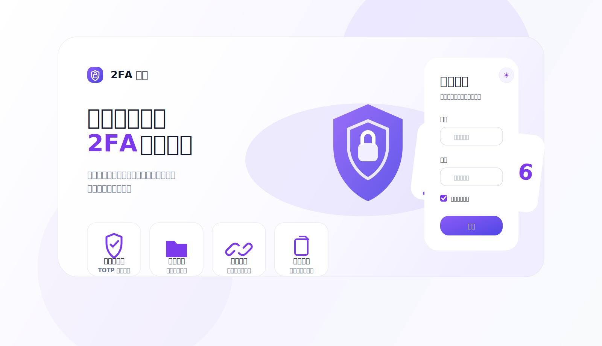
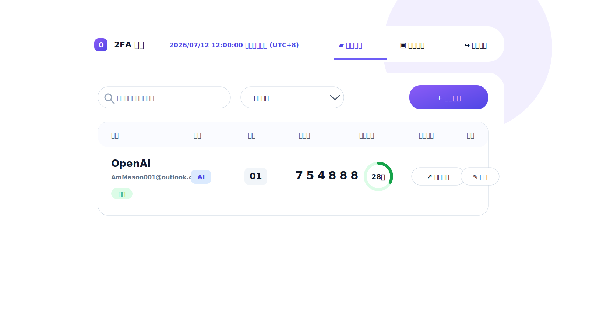
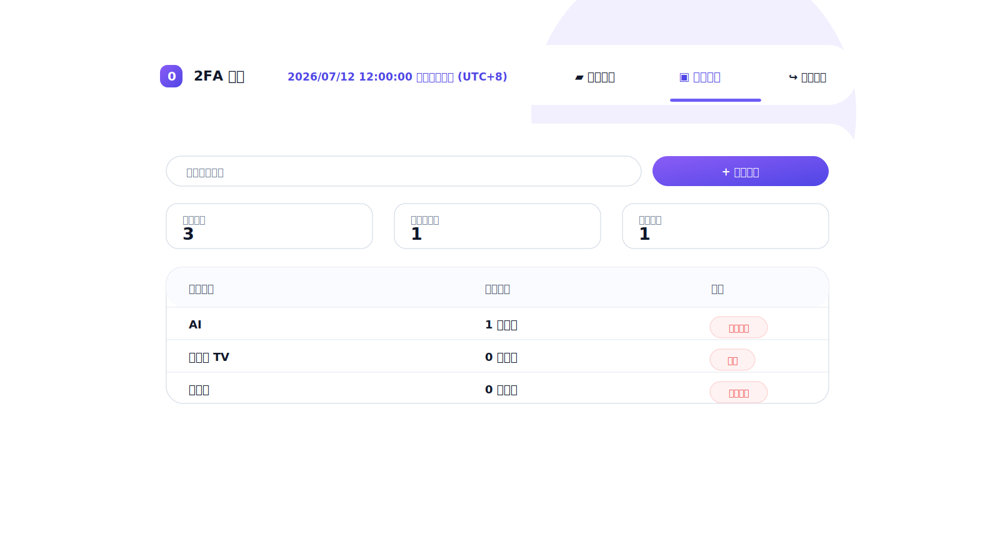
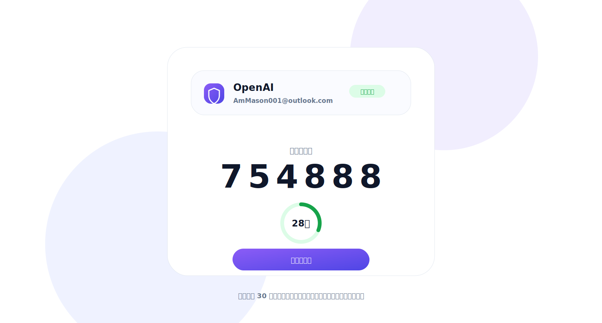

# CloudOTP

一个部署在 Cloudflare Workers + D1 上的现代化 2FA/TOTP 管理看板。

它可以集中保存你有权管理的 TOTP 密钥，自动生成 6 位验证码，并为每个账号提供独立、可停用、可重置的分享链接。

> 适合团队共享服务账号、运维账号、内部工具账号的验证码管理。请只用于你有权管理的账号；分享链接本身等同敏感凭据，不要公开传播。

<p align="center">
  <a href="https://deploy.workers.cloudflare.com/?url=https://github.com/Time999-1/CloudOTP">
    
  </a>
</p>



## 功能亮点

- 管理员登录、会话 Cookie、CSRF 防护
- 账号、分类、分享编号、备注统一管理
- 6 位 TOTP 验证码实时刷新，30 秒倒计时
- 每个账号独立分享链接，支持停用和重置
- 账号搜索、分类筛选、复制验证码
- 分类管理页与账号列表页
- 分享验证码查看页，适合只给使用者查看验证码
- 分享访问日志
- 日间、夜间、跟随系统主题
- TOTP 原始密钥使用 Web Crypto AES-GCM 加密保存
- Cloudflare Workers + D1，无需服务器、容器或长期运行进程

## 页面预览

### 登录页

专业 2FA 管理平台入口，支持主题切换、记住登录状态和密码显示/隐藏。


### 账号管理

集中查看账号分类、分享编号、当前验证码、倒计时、分享链接和编辑操作。



### 分类管理

管理账号分类，快速查看分类数量、可删除分类和账号总数。



### 分享验证码页面

只展示指定账号的验证码，适合给成员或临时协作者有限共享。



## 快速部署

### 方式一：一键部署到 Cloudflare

点击下面按钮，按照 Cloudflare 页面提示完成导入和部署：

[](https://deploy.workers.cloudflare.com/?url=https://github.com/Time999-1/CloudOTP)

部署过程中需要配置 3 个敏感变量：

| 变量 | 说明 |
| --- | --- |
| `ADMIN_PASSWORD` | 管理员初始密码，建议至少 12 位 |
| `SESSION_SECRET` | 会话签名密钥，建议使用 `openssl rand -hex 32` 生成 |
| `APP_ENCRYPTION_KEY` | TOTP 密钥加密用主密钥，必须独立随机生成并离线备份 |

> `APP_ENCRYPTION_KEY` 部署后不要随意修改。修改后，数据库里已保存的 TOTP 密钥将无法解密。

### 部署流程图


### 方式二：本地命令部署

需要 Node.js 20 或更高版本。

```bash
git clone https://github.com/Time999-1/CloudOTP.git
cd CloudOTP
npm install
cp .dev.vars.example .dev.vars
```

编辑 `.dev.vars`，填入：

```dotenv
ADMIN_PASSWORD=your-strong-password
SESSION_SECRET=replace-with-random-secret
APP_ENCRYPTION_KEY=replace-with-random-encryption-key
```

本地启动：

```bash
npm run dev
```

命令行部署：

```bash
npx wrangler login
npm run deploy
```

`npm run deploy` 会发布 Worker、配置 D1，并执行远程数据库迁移。

## 图片教程：一键部署步骤

1. 点击 README 顶部的 `Deploy to Cloudflare`。
2. 登录 Cloudflare 账号，并授权复制该仓库。
3. 在部署表单中填写 `ADMIN_PASSWORD`、`SESSION_SECRET`、`APP_ENCRYPTION_KEY`。
4. 等待 Worker 构建完成。
5. 打开 Cloudflare 提供的 `workers.dev` 地址。
6. 使用账号 `admin` 和你设置的 `ADMIN_PASSWORD` 登录。
7. 进入账号管理页，添加分类和 TOTP 账号。
8. 如需共享验证码，点击账号对应的分享链接。

首次部署后建议访问：

```text
https://你的域名/health
```

如果登录页提示数据表不存在，请执行数据库迁移：

```bash
npx wrangler d1 migrations apply DB --remote
```

或本地配置 Wrangler 后运行：

```bash
npm run db:migrations:apply
```

## 使用说明

### 管理员账号

默认管理员用户名固定为：

```text
admin
```

密码为部署时设置的：

```text
ADMIN_PASSWORD
```

### 添加 TOTP 账号

进入后台后，点击「添加账号」，填写：

- 账号名称
- 所属分类
- 分享编号
- 账号标识，例如邮箱、用户名
- TOTP Secret Key
- 备注，可选

保存后，系统会自动生成当前验证码。

### 分享验证码

每个账号都有独立分享链接：

- 可以复制给需要查看验证码的人
- 可以随时停用
- 可以重置链接，旧链接会立即失效

如果怀疑链接泄露，请立即在后台重置。

## 本地开发

```bash
npm install
cp .dev.vars.example .dev.vars
npm run dev
```

运行测试：

```bash
npm test
```

检查 Worker 构建：

```bash
npx wrangler deploy --dry-run
```

## 数据备份

请同时备份：

1. Cloudflare D1 数据库
2. `APP_ENCRYPTION_KEY`

只有数据库、没有原加密密钥时，已保存的 TOTP 密钥无法恢复。

## 安全说明

- TOTP 原始密钥只在 Worker 内部解密，浏览器端不会获取原始密钥。
- 分享令牌使用 SHA-256 摘要检索。
- 分享令牌副本使用 AES-GCM 加密保存。
- 管理会话使用 `HttpOnly`、`Secure`、`SameSite=Lax` Cookie。
- 管理会话默认 12 小时失效。
- 分享链接泄露后应立即重置。

## 适合场景

- 团队共享服务账号 2FA
- 运维账号验证码集中管理
- 内部系统临时验证码共享
- 多个账号分类管理
- 不想自建服务器，只想使用 Cloudflare 免费/低成本托管

## License

本项目供个人和团队自托管使用。使用前请确认你有权管理相关账号和 TOTP 密钥。
