# CloudOTP

CloudOTP 是一个部署在 Cloudflare Workers + D1 上的 2FA/TOTP 管理看板。它可以集中保存 TOTP 密钥、实时生成 6 位验证码，并为每个账号提供独立分享链接，适合个人或团队自托管使用。

> 请只保存你有权管理的账号密钥。分享链接可以看到验证码，泄露后应立即停用或重置。

[](https://deploy.workers.cloudflare.com/?url=https://github.com/newszx/CloudOTP)

## 预览

电脑端和手机端都已适配，后台可管理账号、分组和分享链接，分享页可单独查看验证码。

<p align="center">
  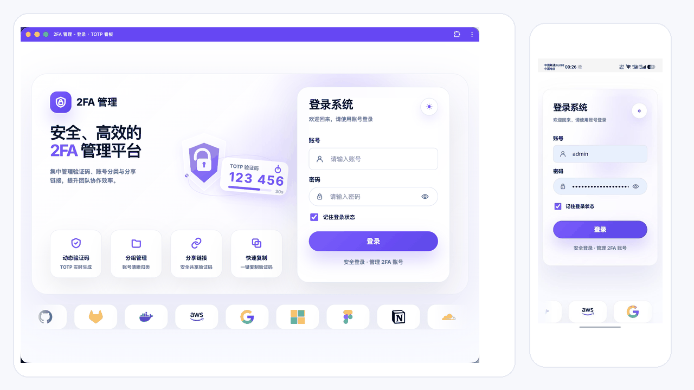
</p>

<details>
  <summary>展开查看静态截图</summary>

<table>
  <tr>
    <td width="50%">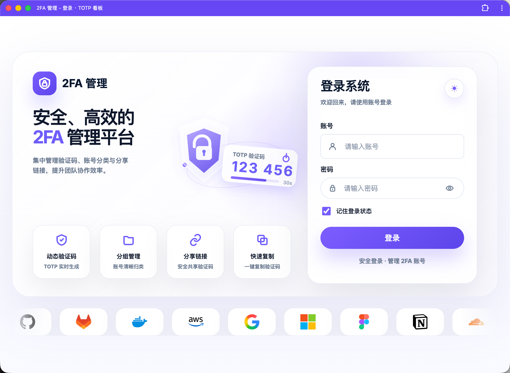</td>
    <td width="50%">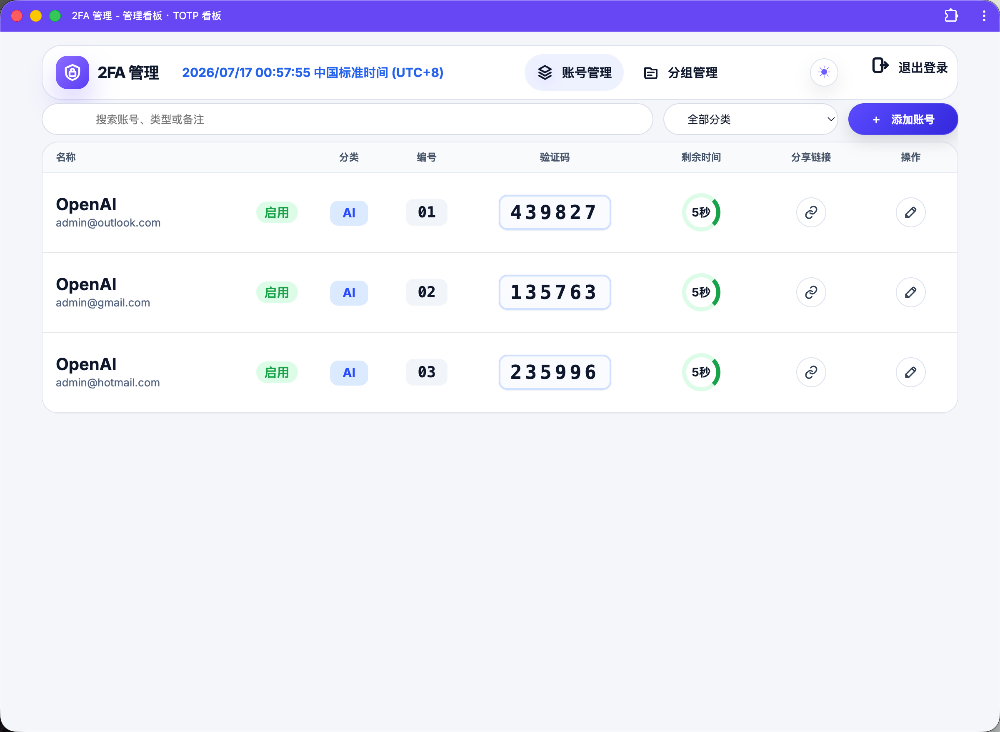</td>
  </tr>
  <tr>
    <td align="center">登录页</td>
    <td align="center">账号管理</td>
  </tr>
  <tr>
    <td width="50%">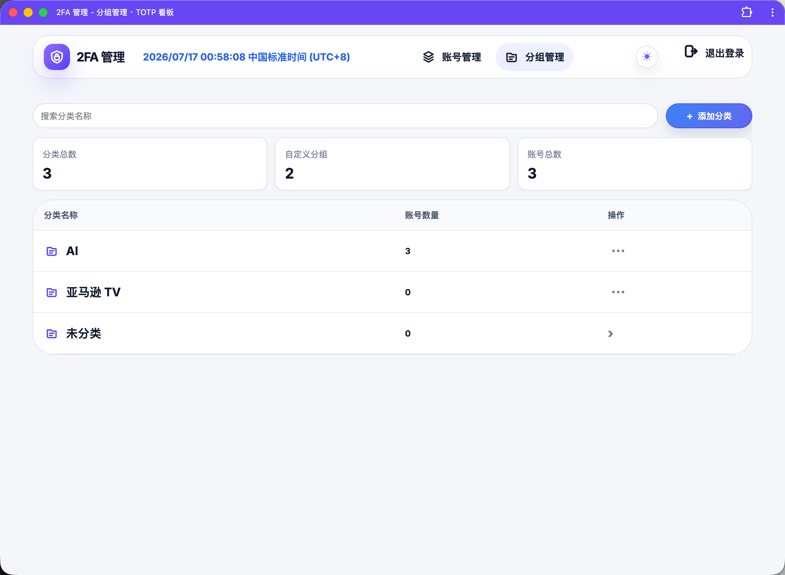</td>
    <td width="50%">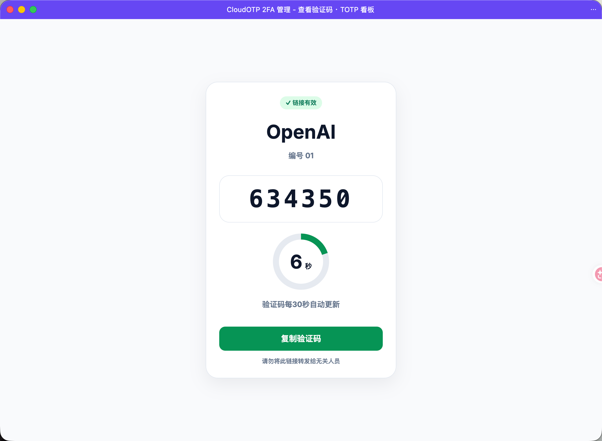</td>
  </tr>
  <tr>
    <td align="center">分组管理</td>
    <td align="center">分享验证码</td>
  </tr>
</table>

<table>
  <tr>
    <td width="25%">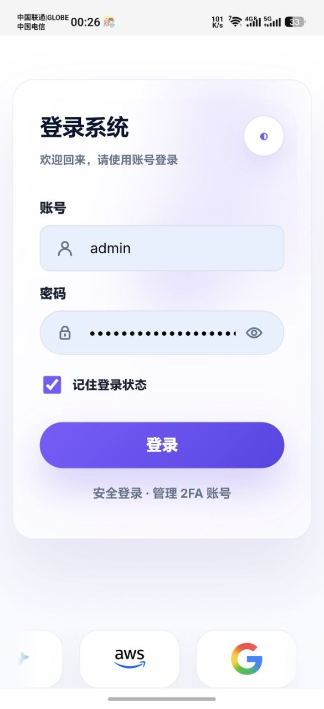</td>
    <td width="25%">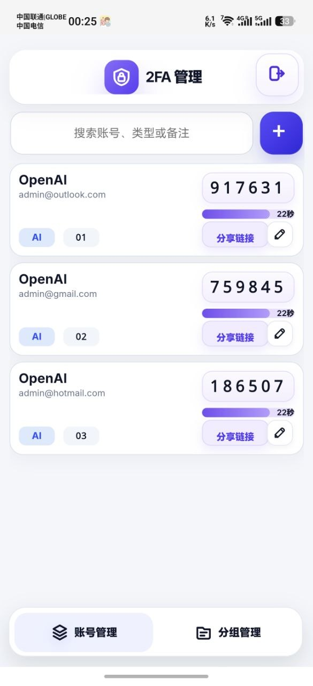</td>
    <td width="25%">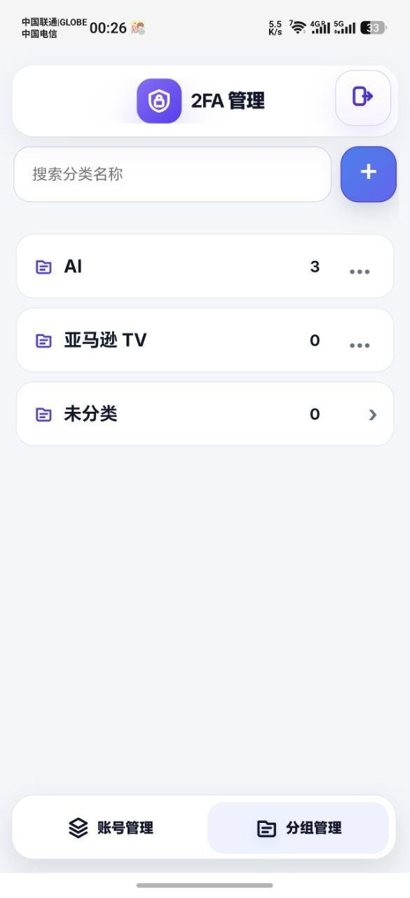</td>
    <td width="25%">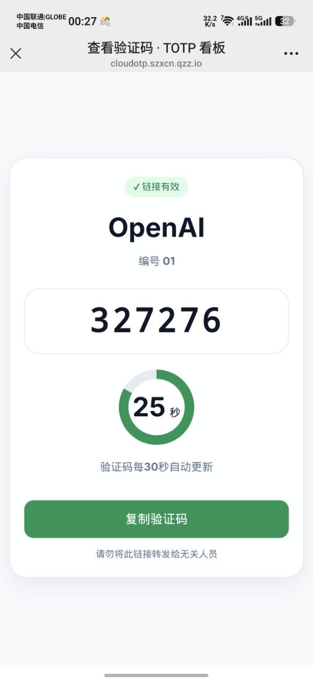</td>
  </tr>
  <tr>
    <td align="center">登录</td>
    <td align="center">账号</td>
    <td align="center">分组</td>
    <td align="center">分享页</td>
  </tr>
</table>

</details>

## 功能

- 管理员登录、CSRF 防护、12 小时会话
- 账号管理：名称、分类、编号、账号、备注、TOTP 密钥
- 分类管理：添加、搜索、删除空分类
- 验证码自动刷新，30 秒倒计时，一键复制
- 每个账号独立分享链接，支持停用、启用、重置、删除账号
- TOTP 原始密钥使用 Web Crypto AES-GCM 加密保存
- 基于 Cloudflare Workers + D1，自托管无需服务器
- 兼容电脑网页和手机网页

## 部署教程

### 方式一：一键部署

1. 点击上方 `Deploy to Cloudflare` 按钮。
2. 登录 Cloudflare 账号。
3. 按页面提示授权并导入 `newszx/CloudOTP` 仓库。
4. 创建或绑定一个 D1 数据库，绑定名必须填写 `DB`。
5. 添加下面 3 个环境变量。
6. 完成部署后，打开 Cloudflare 分配的 `workers.dev` 地址。
7. 使用用户名 `admin` 和你设置的 `ADMIN_PASSWORD` 登录后台。

| 变量名 | 作用 | 建议 |
| --- | --- | --- |
| `ADMIN_PASSWORD` | 管理员登录密码 | 建议至少 12 位，包含大小写、数字和符号 |
| `SESSION_SECRET` | 登录会话签名密钥 | 使用随机字符串 |
| `APP_ENCRYPTION_KEY` | 加密 TOTP 密钥的主密钥 | 必须备份，后续不要随意更换 |

可以在本地终端生成随机密钥：

```bash
openssl rand -hex 32
```

> `APP_ENCRYPTION_KEY` 一旦更换，旧数据里的 TOTP 密钥将无法解密。请和 D1 数据库一起备份。

### 方式二：命令行部署

需要提前安装 Node.js 20 或更高版本，并登录 Wrangler。

```bash
git clone https://github.com/newszx/CloudOTP.git
cd CloudOTP
npm install
npx wrangler login
```

创建 D1 数据库：

```bash
npx wrangler d1 create cloudotp-db
```

把命令输出中的 `database_id` 填到 `wrangler.jsonc`：

```jsonc
"d1_databases": [
  {
    "binding": "DB",
    "database_name": "cloudotp-db",
    "database_id": "这里填写你的 database_id",
    "migrations_dir": "migrations"
  }
]
```

设置生产环境变量：

```bash
npx wrangler secret put ADMIN_PASSWORD
npx wrangler secret put SESSION_SECRET
npx wrangler secret put APP_ENCRYPTION_KEY
```

部署并执行远程数据库迁移：

```bash
npm run deploy
```

部署完成后访问 Workers 地址，使用 `admin` 和 `ADMIN_PASSWORD` 登录。

## 首次使用

<table>
  <tr>
    <td width="50%">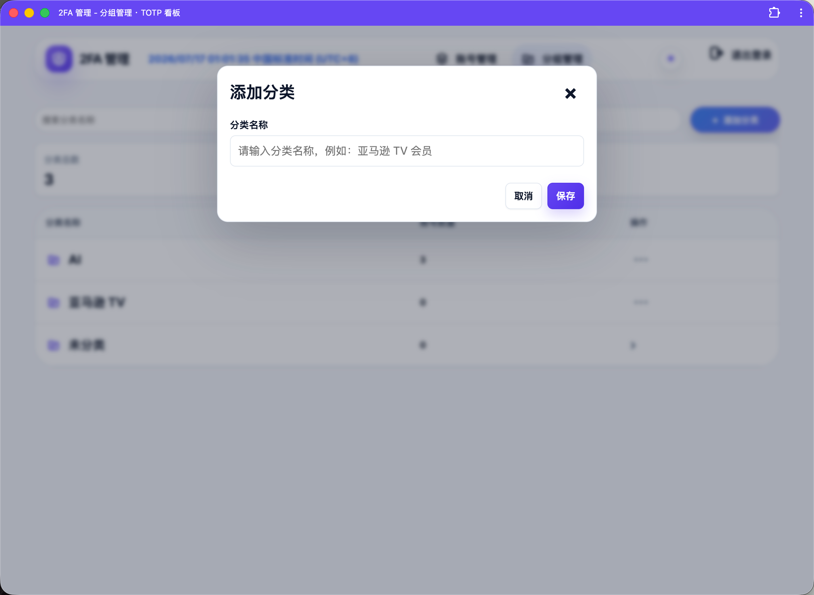</td>
    <td width="50%">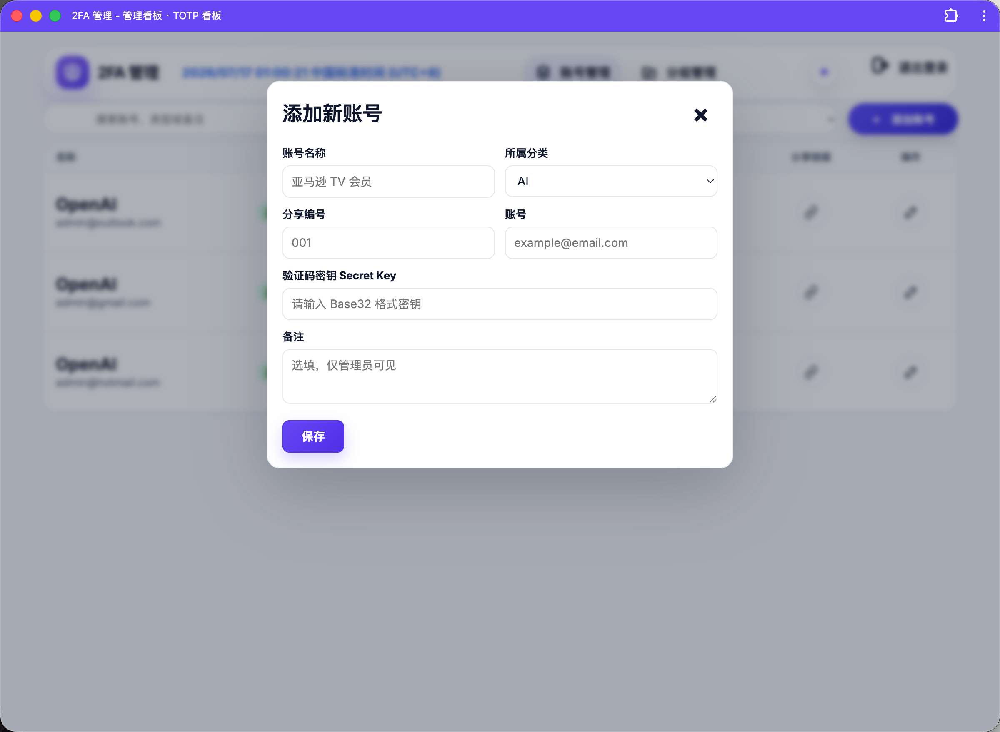</td>
  </tr>
  <tr>
    <td align="center">先添加分类</td>
    <td align="center">再添加账号</td>
  </tr>
</table>

1. 进入「分组管理」，点击「添加分类」。
2. 输入分类名称并保存，例如 `AI`、`亚马逊 TV`。
3. 进入「账号管理」，点击「添加账号」。
4. 填写账号名称、所属分类、分享编号、账号、Base32 格式的 `Secret Key` 和备注。
5. 保存后，后台会自动生成 TOTP 验证码。
6. 点击分享链接按钮，可复制单个账号的验证码查看链接。

手机端也可以直接完成添加账号和分组管理：

<table>
  <tr>
    <td width="33%">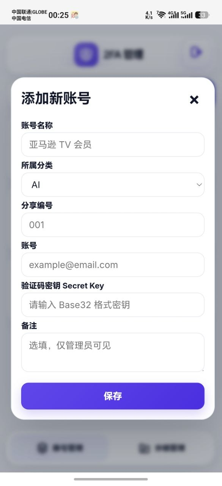</td>
    <td width="33%">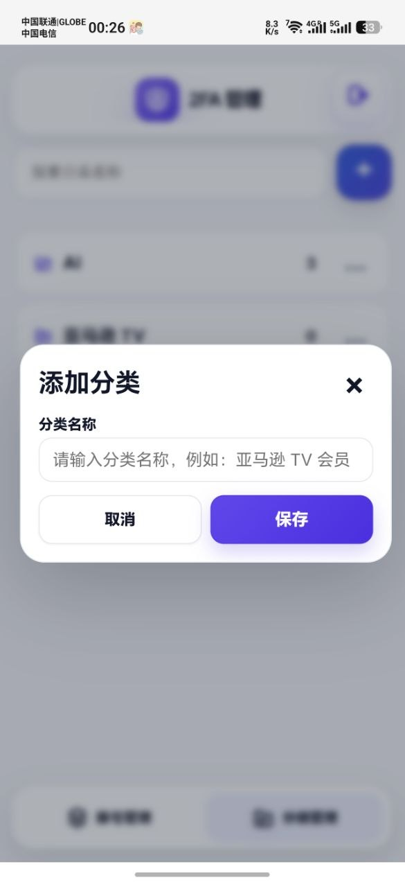</td>
    <td width="33%">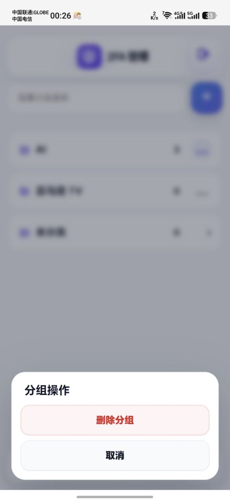</td>
  </tr>
  <tr>
    <td align="center">添加账号</td>
    <td align="center">添加分类</td>
    <td align="center">分组操作</td>
  </tr>
</table>

## 常用操作

- **复制验证码**：点击后台验证码，或在分享页点击「复制验证码」。
- **复制分享链接**：在账号列表点击链接按钮。
- **停用分享**：编辑账号后点击「停用分享」，旧分享页会变为无效。
- **重置分享**：编辑账号后点击「重置链接」，旧链接立即失效。
- **删除账号**：编辑账号后点击「删除账号」。
- **删除分类**：分类为空且不是「未分类」时才可删除。

## 本地开发

```bash
git clone https://github.com/newszx/CloudOTP.git
cd CloudOTP
npm install
cp .dev.vars.example .dev.vars
npm run dev
```

运行测试：

```bash
npm test
```

健康检查：

```text
https://你的域名/health
```

如果提示数据表不存在，可以手动执行远程迁移：

```bash
npm run db:migrations:apply
```

## 数据备份

请同时备份：

- Cloudflare D1 数据库
- `APP_ENCRYPTION_KEY`

只有数据库、没有原加密密钥时，已保存的 TOTP 密钥无法恢复。

## License

本项目供个人和团队自托管使用。使用前请确认你有权管理相关账号和 TOTP 密钥。
